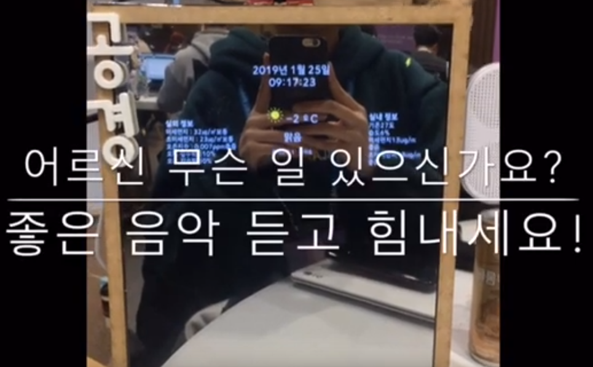

# 독거노인 우울증 치료를 돕기 위한 '스마트 미러' (2019.01.24 ~ 2019.01.25)  
* [동영상 링크](https://www.youtube.com/watch?v=Ac3FZgG-5a8 "유튜브")  
* socket.io를 이용한 vue랑 python 통신: s.py <-> src/components/helloworld.vue  
* 인하대, 서강대, 서울대, 숙명여대, 영남대, 이화여대, 카이스트, 포항공대, 한양대 참여 9개 대학
서울시 노인 인구 중 22.3프로가 독거노인
‘실버산업(고령화)’를 주제로 node.js와 vue를 이용한 스마트미러 개발
관리가 필요하거나 기억력이 안좋으신 노인분들을 위해 만든 다루기 쉬운 스마트미러 플랫폼

> 1. 기본화면 -  시계 날씨 온/습도 
> 2. 음성인식 -  나비야 내일 날씨 알려줘
> 3. 감정인식 -  웃는 얼굴 3회,  우는 얼굴 3회
> 4. 화면전환 -  시간 지나면 화면 지나가는 것

* 호칭(나비야) 음성인식 기능  
* 일정 관리 기능  
* 시계/날씨 표시  
* 실내 습도/미세먼지 농도 출력  
* 표정 인식 적용  
* 스마트 액자  
* 구글 어시스턴트  
  

### 2019 슈퍼챌린지 해커톤 '갓오브아이스' 팀

           인하대학교 정보통신공학과 박광석  
           인하대학교 정보통신공학과 최유진  
           인하대학교 정보통신공학과 권동현   
           인하대학교 정보통신공학과 이해단  
           인하대학교 정보통신공학과 최우선  
